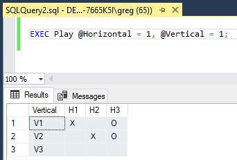

# T-SQL Tic Tac Toe

This is the game tic tac toe written entirely in T-SQL. There are multiple modes:

1. 'free' mode (default), the user plays with both X and O

2. 'easy' mode, the user plays against an AI that plays randomly

3. 'hard' mode, the user plays against a smarter AI

4. 'invincible' mode, the user plays against an unbeatable AI

Here's an easy game I won against the AI:

